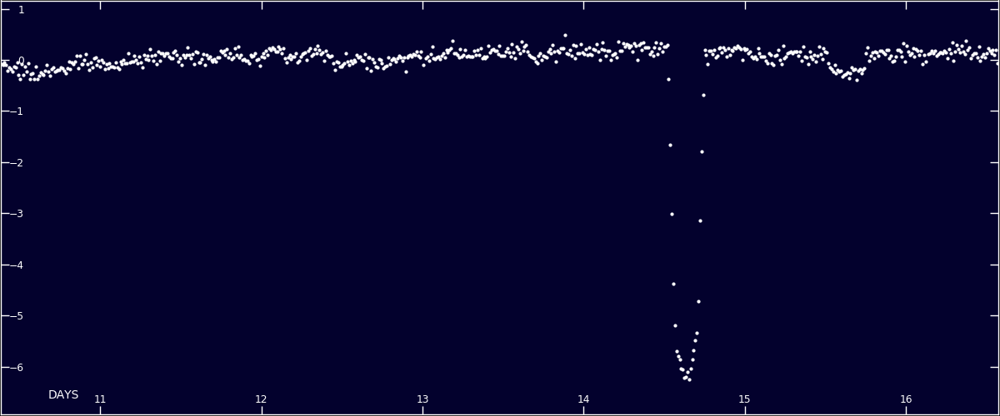

<h1 align="center"><a href="index.md">Wolf Cukier</a></h1>

## My Research

### Geminids Meteoroids
*Paper in prep*

In summer and fall 2021 I worked with [Dr. Jamey Szalay](https://spacephysics.princeton.edu/people/jamey-r-szalay-phd) on simulating the Geminids Meteoroid stream with the primary goal of ruling it out as the source of an anomalous spike in meteroid flux incident upon [Parker Solar Probe.](https://www.nasa.gov/content/goddard/parker-solar-probe)

The simulation and visualization code I wrote is visible at [this GitHub repo.](https://github.com/wcukier/Phaethon_Meteoroids/)

### TOI-1338
*Paper: [Kostov et al. 2020](https://arxiv.org/abs/2004.07783)*

TOI-1338 b is the planet that I helped to discover in the summer before my senior year of high school while I was working with [Dr. Veselin Kostov](http://www.veselinbkostov.com/) at NASA Goddard Space Flight Center.  I was searching through targets identified as Eclipsing Binaries on the citizen science project [Planet Hunters TESS](https://www.zooniverse.org/projects/nora-dot-eisner/planet-hunters-tess) when I noticed an interesting target.  

Below is the original lightcurve that I saw-- the dip between day-14 and day-15 is the primary eclipse (i.e. when the smaller star blocks the light of the bigger star) and the smaller dip between days 15 and 16 is the planetary transit.

*Image Credit [Planet Hunters TESS](https://www.zooniverse.org/projects/nora-dot-eisner/planet-hunters-tess)*

There was a lot of news coverage surrounding this discovery, the following are a couple of my favorites:
 - [Discovery of TESS Mission’s First Circumbinary Planet](https://www.centauri-dreams.org/2020/01/07/discovery-of-tess-missions-first-circumbinary-planet/) by Dr. Ravi Kopparapu -- My advisor from the previous summer and secondary advisor that summer
 -[A teenager discovered a new planet on the third day of his NASA internship](https://www.washingtonpost.com/technology/2020/01/10/teenager-discovered-new-planet-third-day-his-nasa-internship/) by the Washington Post

### Circumbinary Habitable Zones
*Paper: [Cukier et. al. 2019](https://arxiv.org/abs/1911.02983)*
